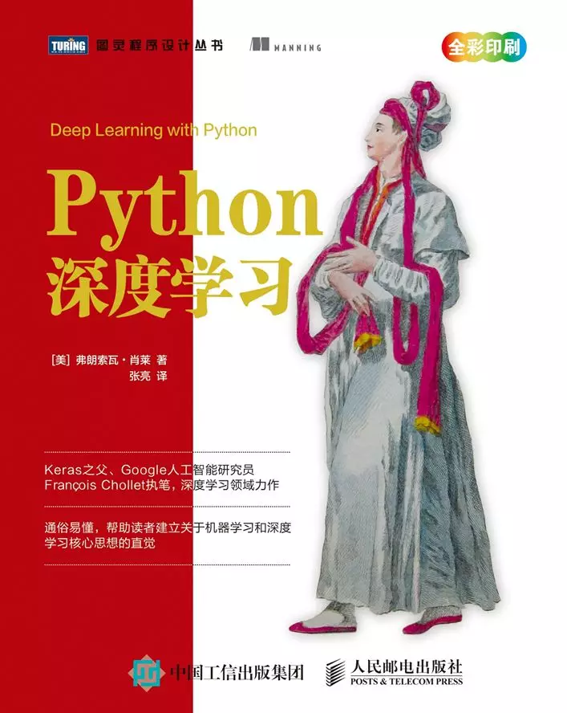

《**python深度学习**》由Keras之父、现任Google人工智能研究员的弗朗索瓦•肖莱（François Chollet）执笔，详尽介绍了用Python和Keras进行深度学习的探索实践，包括计算机视觉、自然语言处理、产生式模型等应用。书中包含30多个代码示例，步骤讲解详细透彻。

作者在github公布了代码，代码几乎囊括了本书所有知识点。在学习完本书后，读者将具备搭建自己的深度学习环境、建立图像识别模型、生成图像和文字等能力。但是有一个小小的遗憾：代码的解释和注释是全英文的，即使英文水平较好的朋友看起来也很吃力。

**本站认为，这本书和代码是初学者入门深度学习及Keras最好的工具。**

**本站对全部代码做了中文解释和注释，并下载了代码所需要的一些数据集（尤其是“猫狗大战”数据集），并对其中一些图像进行了本地化，代码全部测试通过。（请按照文件顺序运行，代码前后有部分关联）。**

**以下代码包含了全书80%左右的知识点，**

**代码目录：**

2.1: A first look at a neural network（ 初识神经网络）

3.5: Classifying movie reviews（电影评论分类：二分类问题）

3.6: Classifying newswires（新闻分类：多分类问题 ）

3.7: Predicting house prices（预测房价：回归问题）

4.4: Underfitting and overfitting（ 过拟合与欠拟合）

5.1: Introduction to convnets（卷积神经网络简介）

5.2: Using convnets with small datasets（在小型数据集上从头开始训练一个卷积

5.3: Using a pre-trained convnet（使用预训练的卷积神经网络）

5.4: Visualizing what convnets learn（卷积神经网络的可视化）

6.1: One-hot encoding of words or characters（单词和字符的 one-hot 编码）

6.1: Using word embeddings（使用词嵌入）

6.2: Understanding RNNs（理解循环神经网络）

6.3: Advanced usage of RNNs（循环神经网络的高级用法）

6.4: Sequence processing with convnets（用卷积神经网络处理序列）

8.1: Text generation with LSTM（使用 LSTM 生成文本）

8.2: Deep dream（DeepDream）

8.3: Neural style transfer（ 神经风格迁移）

8.4: Generating images with VAEs（用变分自编码器生成图像）

8.5: Introduction to GANs（生成式对抗网络简介）

**作者的github：**
https://github.com/fchollet/deep-learning-with-python-notebooks

**《python深度学习》的购买地址：**
https://item.jd.com/12409581.html

**data目录的数据下载：**
 https://pan.baidu.com/s/1Ni8apGSR56Dyf7nOKBVPNQ 提取码：sdgi
本书运行代码要下载大量的数据，如kaggle“猫狗大战”等数据，我们已经下载了所有本书需要的数据放在上面那个下载链接了。
